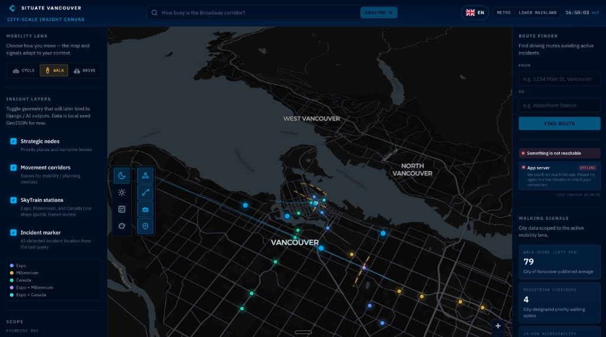
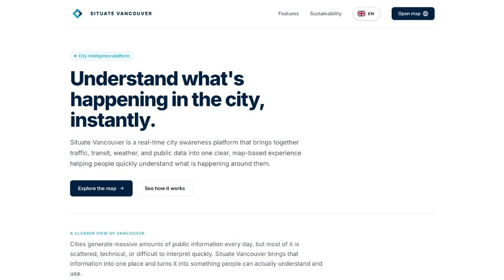
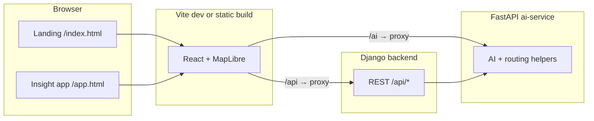

# Situate Vancouver

**City-scale insight for Metro Vancouver** — a map-first workspace that combines live-style layers, mobility context, and AI-assisted queries over a modern web stack.

Situate began as a **hackathon project** and has grown into a structured monorepo aimed at production-style integration between a **Django** API, a **FastAPI** AI service, and a **React + MapLibre** frontend.

---

## Screenshots

These images are **current product screenshots** from development (**pre-deployment**). They document layout, map layers, and the marketing experience. Some captures may show **offline or partial backend status** (for example when API services are not running). **After deployment**, we will refresh them with versions taken against **live services** (healthy connectivity, optional AI split-view analysis). Details and a replacement checklist live in [`docs/screenshots/README.md`](docs/screenshots/README.md).

### Insight workspace (`/app.html`)



### Marketing landing (`/`)



---

## Product overview

| | |
|---:|---|
| **Audience** | Planners, operators, and residents who need a **single canvas** for Vancouver-area mobility and incident context. |
| **Experience** | A **marketing landing** at `/` and a dedicated **insight app** at `/app.html` with a full-screen **MapLibre GL** map, configurable **insight layers**, and **natural-language queries** that can drive map focus and analysis. |
| **Returning visitors** | Browsers that have opened the map app once are routed straight to `/app.html` on subsequent visits to `/` (localStorage; see `frontend/public/situate-returning-user.js`). |

---

## Map and frontend (technical)

The insight application is a **Vite + React 19** SPA (`frontend/`), lazy-loading a **`VancouverMap`** component built on **MapLibre GL JS** with vector basemaps (configurable styles in `map/basemapConfig`).

**Layer model**

- **Strategic nodes** — GeoJSON point layer for priority places (narrative / planning lenses).
- **Movement corridors** — Line geometry for mobility / planning “spines.”
- **SkyTrain stations** — Enriched Expo / Millennium / Canada Line stops with line-aware styling.
- **Incident markers** — AI-query results and/or backend **incidents** (see `useIncidents` + Django API).
- **Mobility lens** — Per-mode **cycle / walk / drive** overlays (`lensOverlays`) toggled from the UI; styling ties to `MOBILITY_LENS_META`.

**Interaction**

- Clickable nodes with popups (including optional thumbnail enrichment for stations).
- **AI query bar** in the shell header: responses can open a **split view** (`AiResponsePanel`) and focus the map on coordinates.
- **Route finding** — `RouteFindingPanel` + `routeService.findRoute()` for origin/destination routing with incident-aware results (FastAPI + Django proxy).
- **Status / health** — `StatusPanel` surfaces API connectivity via the Django health proxy pattern used in dev.

**Auth UI (optional)**

- Header sign-in / sign-up is **gated** by `VITE_ENABLE_AUTH_UI`; see `docs/auth-backend-handoff.md` for backend wiring.

---

## Architecture



| Layer | Role | Default dev port |
|-------|------|------------------|
| **Frontend** | Vite, React, MapLibre, static marketing page | **5173** |
| **Django** | REST API, health, query proxy to AI | **1111** |
| **FastAPI** | AI endpoints, route-related services | **8001** |

---

## Repository layout

| Path | Contents |
|------|----------|
| `frontend/` | Vite app, MapLibre map, UI shell, Jest tests |
| `backend/` | Django project |
| `ai-service/` | FastAPI application |
| `docs/` | Team docs (e.g. auth handoff, screenshot assets) |
| `scripts/` | Dev orchestration (`dev-run.sh`, etc.) |
| `Makefile` | Local and Docker shortcuts |

---

## Local development

**Prerequisites:** Node.js (LTS), Python 3, pip. Copy **`.env.example`** to **`.env`** at the repository root.

**One command (recommended)** — after installing backend + ai-service venv deps and `npm install` in `frontend/` once:

```bash
make run
```

Ports and bind addresses are read from repo-root **`.env`** (`DJANGO_DEV_*`, `AI_DEV_*`, `FRONTEND_DEV_*`, `API_PROXY_TARGET`, `AI_PROXY_TARGET`, `AI_SERVICE_URL`, …).

**Manual (three terminals)** — same as the historical workflow:

1. **Backend**

   ```bash
   cd backend
   python3 -m venv .venv && source .venv/bin/activate
   pip install -r requirements.txt
   python manage.py migrate
   python manage.py runserver 127.0.0.1:1111
   ```

2. **AI service**

   ```bash
   cd ai-service
   python3 -m venv .venv && source .venv/bin/activate
   pip install -r requirements.txt
   uvicorn app.main:app --reload --port 8001
   ```

3. **Frontend** (proxies `/api` → Django and `/ai` → FastAPI)

   ```bash
   cd frontend && npm install && npm run dev
   ```

Open **`http://localhost:5173/`** for the **marketing landing**. The **insight canvas** (map + rails) is at **`http://localhost:5173/app.html`**.

**Tests**

```bash
cd frontend && npm test
```

The frontend includes `frontend/.npmrc` with `legacy-peer-deps=true` for consistent ESLint peer resolution.

**Docker Compose**

```bash
docker compose up --build
```

**Stop local dev servers**

```bash
make stop
```

---

## Sample URLs

| Resource | URL |
|----------|-----|
| Django health | `GET http://localhost:1111/api/health/` |
| AI health | `GET http://localhost:8001/health` |
| FastAPI docs | `http://localhost:8001/docs` |

Environment variables live in the repo-root **`.env`** file.

---

## API / Vite proxy (troubleshooting)

The dev server proxies browser requests from `/api/*` to Django. The default target is `http://127.0.0.1:1111`. Vite reads `API_PROXY_TARGET` and `AI_PROXY_TARGET` from the **repository root** `.env` (not only from the shell environment).

- **ECONNREFUSED / “API Unreachable”** — Django is not listening on the proxy target. Start it with `cd backend && python manage.py runserver 127.0.0.1:1111`, or use `make run`.
- **Custom Django / AI ports** — Set `DJANGO_DEV_PORT`, `AI_DEV_PORT`, `AI_SERVICE_URL`, `API_PROXY_TARGET`, and `AI_PROXY_TARGET` in repo-root `.env` (see `.env.example`).
- **`/api/health/`** in dev — A small Vite plugin forwards to Django and returns JSON if Django is down, so the terminal is not spammed with proxy connection errors for that route.

---

## Documentation

| Document | Purpose |
|----------|---------|
| [docs/auth-backend-handoff.md](docs/auth-backend-handoff.md) | Wiring sign-in / sign-up to the backend |
| [docs/commute-beta-plan.md](docs/commute-beta-plan.md) | Friends-and-family commute beta (~10 testers), tailored to app flows |
| [docs/screenshots/README.md](docs/screenshots/README.md) | Adding README screenshots |

---

## Contributing

Issues and pull requests are welcome. For larger changes, open an issue first so the team can align on scope.
